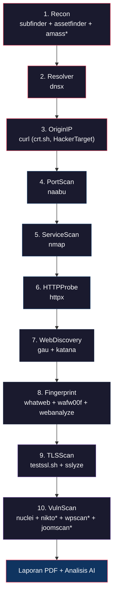

# PentestBot v2 — Referensi Alat Scanning

## Tahapan Pipeline & Ringkasan Alat

Pipeline scan berjalan dalam **10 tahap** secara berurutan. Setiap tahap menggunakan satu atau lebih alat eksternal:

| # | Tahap | Alat | Kegunaan |
|---|-------|------|----------|
| 1 | **Recon** | `subfinder`, `assetfinder`, `anew`, `amass`* | Enumerasi subdomain — menemukan semua subdomain target melalui sumber pasif (certificate transparency, API, database DNS). `anew` menghapus duplikat. |
| 2 | **Resolver** | `dnsx` | Resolusi DNS — menyelesaikan semua subdomain yang ditemukan ke record A, CNAME, MX, TXT, NS. Membangun peta IP-ke-hostname. Fallback ke Python `socket` jika dnsx tidak tersedia. |
| 3 | **OriginIP** | `curl` (ke API crt.sh & HackerTarget) | Penemuan IP asli — mencoba menemukan IP server sebenarnya di balik proxy CDN/WAF menggunakan DNS, certificate transparency, riwayat DNS, dan subdomain bypass umum. |
| 4 | **PortScan** | `naabu` | Pemindaian port TCP cepat — memindai semua IP yang telah di-resolve untuk port terbuka. Menggunakan rate-limiting dan output JSON. Fallback ke socket scan Python jika naabu tidak tersedia. |
| 5 | **ServiceScan** | `nmap` | Deteksi layanan & banner grabbing — menjalankan deteksi versi layanan (`-sV`), skrip default (`-sC`), dan skrip NSE tertarget (SSL, HTTP, FTP, SMTP, RDP, MongoDB, Redis, dll.). |
| 6 | **HTTPProbe** | `httpx` (ProjectDiscovery) | HTTP probing — memeriksa semua URL kandidat web untuk status hidup, kode status, judul halaman, teknologi, dan header web server. Fallback ke `curl` jika httpx tidak tersedia. |
| 7 | **WebDiscovery** | `gau`, `katana` | Perluasan permukaan serangan web — `gau` mengambil URL historis dari sumber pasif; `katana` meng-crawl endpoint hidup untuk menemukan path dan URL berparameter tambahan. |
| 8 | **Fingerprint** | `whatweb`, `wafw00f`, `webanalyze` | Fingerprinting teknologi & deteksi WAF — mengidentifikasi CMS, framework, library, dan WAF yang berjalan di target. |
| 9 | **TLSScan** | `testssl.sh`, `sslyze`, `openssl` | Analisis TLS/SSL — memeriksa validitas sertifikat, cipher suite, versi protokol, dan kerentanan TLS yang diketahui (BEAST, POODLE, Heartbleed, dll.). |
| 10 | **VulnScan** | `nuclei`, `nikto`, `wpscan`*, `joomscan`* | Pemindaian kerentanan — scanning berbasis template (Nuclei), pemeriksaan miskonfigurasi web server (Nikto), dan scanner khusus CMS jika terdeteksi. |

> [!NOTE]
> Alat yang ditandai `*` hanya diaktifkan secara kondisional (mode deep atau deteksi CMS).

---

## Perintah (Command) Setiap Alat per Mode

### Tahap 1: Recon — Enumerasi Subdomain

#### subfinder (Kedua Mode)
```bash
subfinder -d <target> -silent -t 10 -timeout 150 -all
```

#### assetfinder (Kedua Mode)
```bash
assetfinder --subs-only <target>
```

#### anew (Kedua Mode) — Deduplikasi
```bash
# Menerima input dari stdin, menghasilkan baris unik
echo "<semua_subdomain>" | anew <file_seen>
```

#### amass (Hanya Deep Mode ✦)
```bash
amass enum -passive -d <target> -timeout 10
# timeout dalam menit (amass_timeout=600s ÷ 60 = 10 menit)
```

---

### Tahap 2: Resolver — Resolusi DNS

#### dnsx (Kedua Mode)
```bash
dnsx -l <subdomains.txt> -silent -a -cname -mx -txt -ns -resp -json -o <dns_records.json>
```

#### Fallback: Python socket (Kedua Mode)
```python
# Jika dnsx tidak tersedia, menggunakan socket.gethostbyname_ex()
# Dibatasi 50 host
```

---

### Tahap 3: OriginIP — Penemuan IP Asli

#### crt.sh via curl (Kedua Mode)
```bash
curl -s --max-time 15 "https://crt.sh/?q=%25.<target>&output=json"
```

#### HackerTarget via curl (Kedua Mode)
```bash
curl -s --max-time 10 "https://api.hackertarget.com/hostsearch/?q=<target>"
```

#### Bypass Subdomain Probing (Kedua Mode)
```python
# Mencoba resolve DNS untuk:
# direct.<target>, origin.<target>, real.<target>, backend.<target>,
# www2.<target>, mail.<target>, ftp.<target>, cpanel.<target>,
# webmail.<target>, dev.<target>, staging.<target>
```

---

### Tahap 4: PortScan — Pemindaian Port

#### naabu — Quick Mode
```bash
naabu -l <targets.txt> -rate 1000 -retries 3 -silent -json -exclude-cdn \
      -top-ports 1000 -p 21,22,23,25,53,80,110,143,389,443,445,465,587,993,995,\
      1433,1521,2049,3000,3306,3389,4443,5000,5432,5900,6379,7443,8000,8080,\
      8081,8443,8888,9000,9090,9200,9443,27017
# Timeout: 300 detik
```

#### naabu — Deep Mode ✦
```bash
naabu -l <targets.txt> -rate 2000 -retries 3 -silent -json -exclude-cdn \
      -top-ports full -p 21,22,23,25,53,80,110,...,27017
# Timeout: 600 detik
# "full" = semua 65535 port TCP
```

#### Fallback: Python socket (Kedua Mode)
```python
# Scan TCP connect pada port umum:
# 21,22,23,25,53,80,110,143,443,445,3306,3389,5432,5900,6379,8080,8443,9200,27017
# Timeout per koneksi: 2 detik
```

---

### Tahap 5: ServiceScan — Deteksi Layanan

#### nmap — Quick Mode
```bash
nmap -T4 --open -p <port_list> \
     -oX <nmap.xml> -oG <nmap.gnmap> \
     --script banner,http-title,http-methods,http-server-header,ssl-cert,\
              ssl-enum-ciphers,ftp-anon,smtp-open-relay,rdp-enum-encryption,\
              vnc-info,mongodb-info,redis-info,ms-sql-info \
     -sV -sC \
     <target_ips>
# Maksimal 50 port teratas yang di-fingerprint
# Timeout: 800 detik
```

#### nmap — Deep Mode ✦
```bash
nmap -T3 --open -p <port_list> \
     -oX <nmap.xml> -oG <nmap.gnmap> \
     --script banner,http-title,http-methods,http-server-header,ssl-cert,\
              ssl-enum-ciphers,ftp-anon,smtp-open-relay,rdp-enum-encryption,\
              vnc-info,mongodb-info,redis-info,ms-sql-info \
     -sV -sC --script vuln \
     <target_ips>
# Maksimal 200 port teratas yang di-fingerprint
# Timing T3 (lebih lambat, lebih teliti)
# Menambahkan --script vuln untuk deteksi kerentanan
# Timeout: 1200 detik
```

> [!NOTE]
> Jika `-O` (deteksi OS) gagal karena tidak memiliki hak root, nmap otomatis dijalankan ulang tanpa flag `-O`.

---

### Tahap 6: HTTPProbe — Probing HTTP

#### httpx — Quick Mode
```bash
httpx -list <probe_urls.txt> -silent -json -status-code -title \
      -tech-detect -web-server -follow-redirects \
      -threads 50 -timeout 15 -rate-limit 150 \
      -o <httpx_output.json>
```

#### httpx — Deep Mode ✦
```bash
httpx -list <probe_urls.txt> -silent -json -status-code -title \
      -tech-detect -web-server -follow-redirects \
      -threads 80 -timeout 15 -rate-limit 250 \
      -o <httpx_output.json>
# Thread lebih banyak, rate limit lebih tinggi
```

#### Fallback: curl (Kedua Mode)
```bash
# Untuk setiap URL (maks 60):
curl -s -o /dev/null -w "%{http_code}|%{url_effective}" -L --max-time 10 -k <url>
```

---

### Tahap 7: WebDiscovery — Penemuan URL Web

#### gau (Kedua Mode, timeout berbeda)
```bash
gau --subs <target>
# Quick timeout: 120 detik | Deep timeout: 240 detik
```

#### katana — Quick Mode
```bash
katana -list <seeds.txt> -silent -d 2 -jc
# Kedalaman crawl: 2 level
# Timeout: 180 detik
# Maks URL disimpan: 150
```

#### katana — Deep Mode ✦
```bash
katana -list <seeds.txt> -silent -d 4 -jc
# Kedalaman crawl: 4 level
# Timeout: 360 detik
# Maks URL disimpan: 500
```

> [!NOTE]
> Jika flag `-jc` tidak didukung, katana otomatis dijalankan ulang tanpa flag tersebut.

---

### Tahap 8: Fingerprint — Fingerprinting Teknologi

#### whatweb (Kedua Mode)
```bash
whatweb --no-errors --log-json=<whatweb_output.json> -a 3 <target_url>
# Level agresi 3 (pasif + konten)
# Output ke file JSON untuk menghindari IOError
# Timeout: 120 detik
```

#### wafw00f (Kedua Mode)
```bash
wafw00f <target_url> -o - -f json
# Output JSON ke stdout
# Timeout: 60 detik
```

#### webanalyze (Kedua Mode)
```bash
webanalyze -host <target_url> -output json -silent
# Timeout: 60 detik

# Jika gagal karena technologies.json hilang, otomatis menjalankan:
webanalyze -update
# Lalu mencoba lagi
```

---

### Tahap 9: TLSScan — Analisis TLS/SSL

#### testssl.sh (Kedua Mode)
```bash
testssl.sh --quiet --jsonfile <testssl_output.json> --severity LOW --fast --sneaky <host:port>
# --fast: mode cepat
# --sneaky: meniru browser biasa
# Timeout: 500 detik
```

#### sslyze (Kedua Mode, jika testssl berhasil)
```bash
python -m sslyze --json_out=- <host:port>
# Validasi TLS sekunder
# Timeout: 180 detik
```

#### openssl — Fallback (Kedua Mode, jika testssl gagal)
```bash
openssl s_client -connect <host:port>
# Hanya mengekstrak info sertifikat dasar
# Timeout: 30 detik
```

---

### Tahap 10: VulnScan — Pemindaian Kerentanan

#### nuclei — Quick Mode
```bash
nuclei -l <nuclei_urls.txt> -silent -jsonl \
       -severity critical,high,medium \
       -rate-limit 150 -c 15 -bulk-size 10 \
       -t <templates_dir> -duc -no-color
# Maks 4 URL target
# Timeout: 1000 detik
```

#### nuclei — Deep Mode ✦
```bash
nuclei -l <nuclei_urls.txt> -silent -jsonl \
       -severity critical,high,medium,low \
       -rate-limit 250 -c 15 -bulk-size 10 \
       -t <templates_dir> -duc -no-color
# Maks 12 URL target
# Menambahkan severity "low"
# Timeout: 1800 detik

# Jika template tidak ditemukan, otomatis mengunduh:
nuclei -update-templates -duc
```

> [!NOTE]
> Jika flag `-jsonl` gagal, nuclei otomatis mencoba ulang dengan flag `-je` (JSON Events).

#### nikto — Hanya Deep Mode ✦
```bash
nikto -host <hostname> -port <port> -ask no -nointeractive -Tuning 1234578
# Ditambahkan -ssl jika target HTTPS
# Tuning 1234578 = semua kategori tes kecuali DoS
# Quick mode: DINONAKTIFKAN
# Timeout: 600 detik
```

#### wpscan — Kondisional (WordPress terdeteksi)
```bash
wpscan --url <target_url> --no-banner --random-user-agent --format cli
# Hanya berjalan jika fingerprint mendeteksi WordPress
# Timeout: 300 detik
```

#### joomscan — Kondisional (Joomla terdeteksi)
```bash
joomscan -u <target_url>
# Hanya berjalan jika fingerprint mendeteksi Joomla
# Timeout: 300 detik
```

---

## Perbandingan Quick Mode vs Deep Mode

Mode scan default adalah **Quick (cepat)**. Deep mode menerapkan override dari [scan_profiles.py](file:///c:/Users/DELL/OneDrive/Dokumen/22.NarendraYudhistiraBagaskoro_XISIJA1/projectdashboard/backend/scan_profiles.py).

### Perbandingan Parameter

| Parameter | Quick Mode (Default) | Deep Mode | Dampak |
|-----------|---------------------|-----------|--------|
| **Pemindaian Port** ||||
| `naabu_top_ports` | `1000` | `"full"` (semua 65535) | Deep memindai setiap port TCP |
| `naabu_rate` | `1000` pps | `2000` pps | Rate paket lebih cepat di deep |
| `naabu_timeout` | `300d` (5 mnt) | `600d` (10 mnt) | Timeout lebih lama untuk full scan |
| **Deteksi Layanan (nmap)** ||||
| `nmap_flags` | `-sV -sC` | `-sV -sC --script vuln` | Deep menambahkan skrip kerentanan NSE |
| `nmap_timing` | `T4` (agresif) | `T3` (normal) | Deep lebih teliti, lebih lambat |
| `nmap_max_ports` | `50` | `200` | Deep mem-fingerprint 4× lebih banyak port |
| `nmap_timeout` | `800d` | `1200d` (20 mnt) | Timeout lebih lama untuk nmap deep |
| **HTTP Probing** ||||
| `httpx_threads` | `50` | `80` | Konkurensi lebih tinggi di deep |
| `httpx_rate_limit` | `150` req/d | `250` req/d | Probing lebih cepat di deep |
| **Penemuan Web** ||||
| `katana_depth` | `2` level | `4` level | Deep meng-crawl 2× lebih dalam |
| `katana_timeout` | `180d` | `360d` | Anggaran waktu crawl 2× lipat |
| `gau_timeout` | `120d` | `240d` | Waktu pengumpulan URL pasif 2× lipat |
| `max_discovered_urls` | `150` | `500` | Deep menyimpan 3,3× lebih banyak URL |
| **Nuclei (Scanner Kerentanan)** ||||
| `nuclei_severity` | `critical,high,medium` | `critical,high,medium,low` | Deep menyertakan severity **low** |
| `nuclei_rate_limit` | `150` req/d | `250` req/d | Scanning template lebih cepat |
| `nuclei_timeout` | `1000d` | `1800d` (30 mnt) | 80% lebih banyak waktu scanning |
| Maks target nuclei | `4` URL | `12` URL | 3× lebih banyak endpoint yang dipindai |
| **Timeout Pipeline** ||||
| `stage_timeout` | `300d` (5 mnt) | `600d` (10 mnt) | Setiap tahap mendapat waktu 2× lipat |
| `total_scan_timeout` | `4500d` (~75 mnt) | `9000d` (~150 mnt) | Seluruh scan bisa berjalan 2× lebih lama |

### Alat yang Hanya Aktif di Deep Mode

| Alat | Kegunaan | Timeout |
|------|----------|---------|
| `amass` | Enumerasi subdomain komprehensif (lebih berat dari subfinder) | 600d |
| `nikto` | Scanner miskonfigurasi & kerentanan web server | 600d |
| `dirsearch` | Brute-force direktori & file | 300d |
| `s3scanner` | Scanning miskonfigurasi bucket AWS S3 | 240d |

### Alat yang Diaktifkan Secara Kondisional (Kedua Mode)

| Alat | Kondisi Pemicu | Kegunaan |
|------|----------------|----------|
| `wpscan` | WordPress terdeteksi di tahap fingerprint | Scanning kerentanan khusus WordPress |
| `joomscan` | Joomla terdeteksi di tahap fingerprint | Scanning kerentanan khusus Joomla |

> [!IMPORTANT]
> WPScan dan Joomscan **tidak** dipaksa aktif oleh deep mode. Mereka dipicu secara otomatis ketika tahap fingerprint mendeteksi WordPress atau Joomla dalam stack teknologi target — di **kedua** mode scan.

---

## Apa yang Difilter

### 1. Filter Temuan Nuclei

Hasil Nuclei difilter di [vuln_scan.py](file:///c:/Users/DELL/OneDrive/Dokumen/22.NarendraYudhistiraBagaskoro_XISIJA1/projectdashboard/backend/pipeline/vuln_scan.py) melalui `_is_reportable_nuclei_finding()`:

**Filter severity (Quick mode):** Hanya temuan `critical`, `high`, `medium` yang disimpan. Di deep mode, `low` juga disertakan.

**Template ID yang Dikecualikan** — template informasional ini selalu dihapus:

| Template ID yang Dikecualikan | Alasan |
|-------------------------------|--------|
| `rdap-whois` | Lookup WHOIS/RDAP — hanya informasional |
| `dns-waf-detect` | Deteksi WAF — ditangani oleh wafw00f secara terpisah |
| `dns-caa` | Record CAA DNS — informasional |
| `dns-ns` | Record NS — informasional |
| `dns-mx` | Record MX — informasional |
| `dns-soa` | Record SOA — informasional |
| `ssl-dns-names` | Nama DNS sertifikat SSL — informasional |
| `ssl-issuer` | Penerbit sertifikat SSL — informasional |
| `tls-version` | Deteksi versi TLS — ditangani oleh testssl.sh |
| `http-missing-security-headers` | Header hilang — berisik, sering bernilai rendah |

**Fragmen Nama yang Dikecualikan** — temuan dengan fragmen ini di namanya akan dihapus:

| Fragmen | Alasan |
|---------|--------|
| `rdap whois` | Noise lookup WHOIS |
| `ns record` / `mx record` / `soa record` / `caa record` | Enumerasi record DNS — informasional |
| `ssl dns names` / `detect ssl certificate issuer` | Info sertifikat — sudah dicakup tahap TLS |
| `tls version` | Duplikat dari tahap TLS scan |
| `http missing security headers` | Signal rendah, berisik |
| `dns waf detection` | Duplikat dari wafw00f |

**Penanda Deskripsi yang Dikecualikan** — temuan yang mengandung frasa ini dihapus:

| Penanda Deskripsi | Alasan |
|-------------------|--------|
| `registration data access protocol` | RDAP informasional |
| `an ns record was detected` | Info DNS |
| `an mx record was detected` | Info DNS |
| `a caa record was discovered` | Info DNS |
| `extract the issuer` | Info sertifikat (dicakup tahap TLS) |
| `subject alternative name` | Info sertifikat (dicakup tahap TLS) |
| `tls version detection` | Duplikat dari tahap TLS |

---

### 2. Filter Noise Nikto

Output Nikto difilter di `_parse_nikto()`. Baris yang cocok dengan penanda ini **dibuang sebagai noise**:

| Penanda Noise | Apa yang Ditangkap |
|---------------|-------------------|
| `no cgi directories found` | Metadata scanner standar |
| `cgi tests skipped` | Metadata scanner |
| `scan terminated:` | Baris status scanner |
| `host(s) tested` | Footer ringkasan |
| `start time:` / `end time:` | Metadata timestamp |
| `target ip:` / `target hostname:` / `target port:` | Echo info target |
| `platform:` / `server:` | Identifikasi server (dicakup tahap fingerprint) |
| `multiple ips found:` | Informasional |
| `error:` | Error scanner |
| `consider using mitmproxy` | Noise saran Nikto |
| `cannot test http/3 over quic` | Pemberitahuan protokol tidak didukung |
| `uncommon header` | Observasi severity sangat rendah |
| `allowed http methods` | Informasional |
| `strict-transport-security` | Cek kehadiran header (nilai rendah) |
| `x-frame-options` | Cek kehadiran header (nilai rendah) |
| `content-security-policy` | Cek kehadiran header (nilai rendah) |

Selain itu, hanya temuan Nikto yang diklasifikasikan sebagai severity `medium` atau `high` yang dilaporkan — baris level `info` dihapus. Severity ditentukan berdasarkan pencocokan kata kunci:

- **High**: `critical`, `arbitrary`, `remote code execution`, `authentication bypass`, `sql injection`
- **Medium**: `vuln`, `xss`, `sql inject`, `rce`, `remote code`, `cve-`, `command injection`, `path traversal`, `file disclosure`

---

### 3. Filter TLS Scan

Di [tls_scan.py](file:///c:/Users/DELL/OneDrive/Dokumen/22.NarendraYudhistiraBagaskoro_XISIJA1/projectdashboard/backend/pipeline/tls_scan.py), hasil JSON testssl.sh difilter:

| Filter | Apa yang Dihapus |
|--------|-----------------|
| Severity `OK` atau `INFO` | Cek yang lolos dan catatan informasional |
| `"not vulnerable"` dalam temuan | Cek yang secara eksplisit lolos |
| ID `scan_time` / `target` | Metadata scanner |
| Field sertifikat (`cert_*`) | Diekstrak terpisah ke `cert_info` (tidak dihapus, hanya dikategorikan) |
| Temuan inkonklusif (`not tested`, `terminated`, `stalled`, `timed out`, `test failed`) | Dicatat sebagai limitasi, bukan temuan |

**Cek Inkonklusif yang Diabaikan** — hasil inkonklusif ini dibuang secara diam-diam (tidak ditambahkan sebagai limitasi juga):

| ID Cek | Alasan |
|--------|--------|
| `quic` | Dukungan HTTP/3 — tidak bisa ditindaklanjuti |
| `dns_caarecord` / `dns_caa` | Record CAA — informasional |
| `ipv6` | Dukungan IPv6 — bukan kerentanan |
| `rp_banner` | Banner reverse proxy — nilai rendah |
| `trust` | Rantai kepercayaan (biasanya inkonklusif di balik CDN) |
| `caa_rr` | Resource record CAA — informasional |

---

### 4. Filter WhatWeb

Di [fingerprint.py](file:///c:/Users/DELL/OneDrive/Dokumen/22.NarendraYudhistiraBagaskoro_XISIJA1/projectdashboard/backend/pipeline/fingerprint.py), hasil plugin WhatWeb melewatkan plugin generik ini:

| Plugin yang Dilewati | Alasan |
|---------------------|--------|
| `IP` | Alamat IP mentah — bukan teknologi |
| `Country` | Geolokasi — bukan teknologi |
| `HTTPServer` | Header server generik — sudah ditangkap oleh httpx |

---

### 5. Filter Cakupan Web Discovery

Di [web_discovery.py](file:///c:/Users/DELL/OneDrive/Dokumen/22.NarendraYudhistiraBagaskoro_XISIJA1/projectdashboard/backend/pipeline/web_discovery.py), URL yang ditemukan difilter agar tetap dalam cakupan:

| Filter | Aturan |
|--------|--------|
| Skema | Hanya URL `http://` dan `https://` yang disimpan |
| Cakupan hostname | Harus domain target atau subdomain-nya (`*.target.com`) |
| Deduplikasi | Fragment dihapus, trailing slash dihilangkan, duplikat persis digabungkan |
| Batas URL | Quick: maks **150** URL disimpan; Deep: maks **500** |
| Pengurutan prioritas | URL berparameter (`?key=val`) dan path dalam diurutkan terlebih dahulu |

---

## Ringkasan: Quick vs Deep Secara Sekilas

```
┌─────────────────────────────────────────────────────────────┐
│                  QUICK MODE (Cepat)                         │
│                                                             │
│  • 1000 port teratas yang dipindai                          │
│  • Nuclei: critical + high + medium saja                    │
│  • Maks 4 URL target nuclei                                 │
│  • Kedalaman crawl: 2 level                                 │
│  • 150 URL yang ditemukan disimpan                           │
│  • Nikto, Amass, Dirsearch, S3Scanner: NONAKTIF             │
│  • ~75 menit total timeout                                  │
├─────────────────────────────────────────────────────────────┤
│                  DEEP MODE (Mendalam)                        │
│                                                             │
│  • Semua 65535 port dipindai                                │
│  • Nuclei: critical + high + medium + LOW                   │
│  • Maks 12 URL target nuclei                                │
│  • Kedalaman crawl: 4 level                                 │
│  • 500 URL yang ditemukan disimpan                           │
│  • Nikto, Amass, Dirsearch, S3Scanner: AKTIF                │
│  • Nmap menambahkan --script vuln                           │
│  • ~150 menit total timeout                                 │
└─────────────────────────────────────────────────────────────┘
```

---

## Diagram Alur Pipeline


